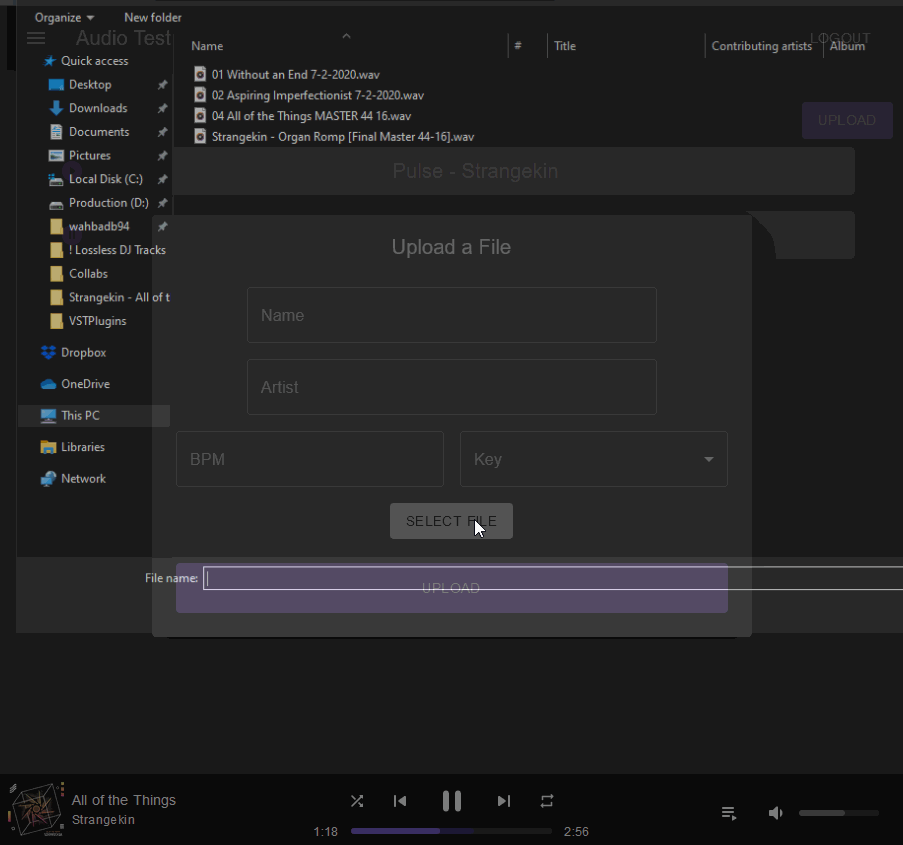

# Music123Api
Web API written in C# and ASP.NET.

1. Allows registered users to upload .wav files and stream their uploaded files on demand.
2. Provides realtime upload and encoding progress to client via SignalR websocket connection.
3. Uses Azure Media Services for encoding from .wav -> AAC as well as for generating the streamingURL.

## demo upload (NOTE: code for client app not in this repo)

